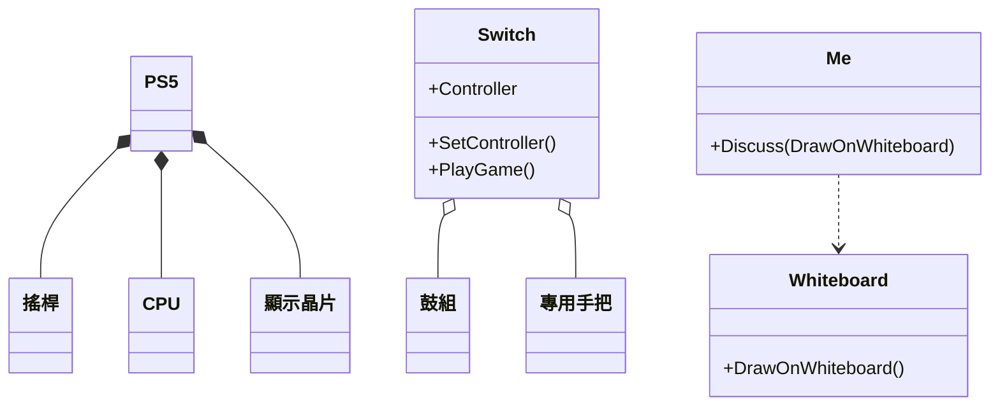
```mermaid
classDiagram
    PS5*--搖桿
    PS5*--CPU
    PS5*--顯示晶片

    class Switch{
        +Controller
        +SetController()
        +PlayGame()
    }
    Switch o-- 鼓組
    Switch o-- 專用手把

    class Me{
        +Discuss(DrawOnWhiteboard)
    }
    class Whiteboard{
        +DrawOnWhiteboard()
    }
    Me ..> Whiteboard
```

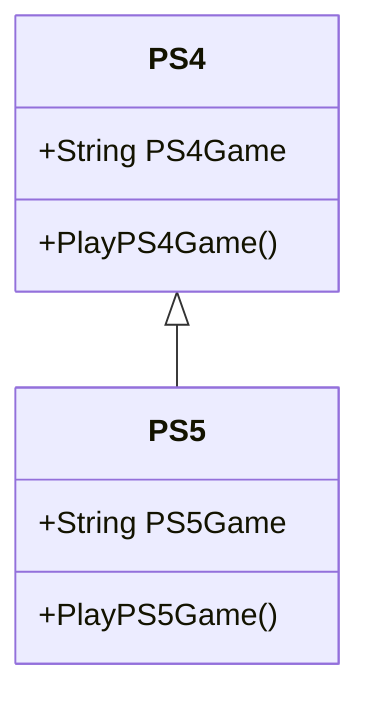
```mermaid
classDiagram

    class PS4{
        +String PS4Game
        +PlayPS4Game()
    }
    class PS5{
        +String PS5Game
        +PlayPS5Game()
    }
    PS4 <|-- PS5
```

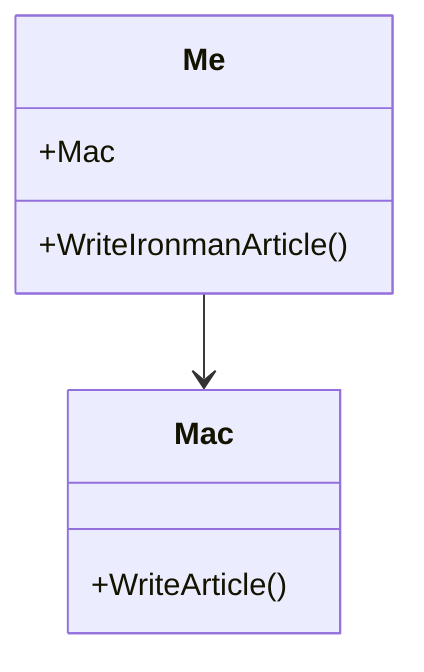
```mermaid
classDiagram

    class Mac{
        +WriteArticle()
    }
    class Me{
        +Mac
        +WriteIronmanArticle()
    }
    Me-->Mac
```

```mermaid
classDiagram
    class CreatePS5{
        <<function>>
        (style): PS5
    }
    class PS5{
        <<interface>>
        PlayGame()
    }
    CreatePS5 --> PS5WithCD
    CreatePS5 --> PS5WithDigital
    PS5 <|.. PS5WithCD
    PS5 <|.. PS5WithDigital
    main ..> PS5: user使用PS5
    main ..> CreatePS5: user獲得PS5
```

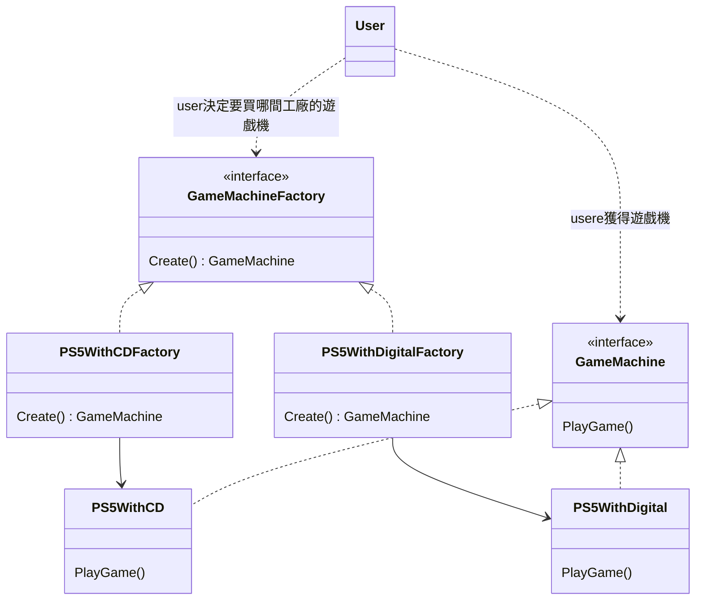
```mermaid
classDiagram
    class GameMachineFactory{
        <<interface>>
        Create() GameMachine
    }
    class PS5WithCDFactory{
        Create() GameMachine
    }
    class PS5WithDigitalFactory{
        Create() GameMachine
    }
    class GameMachine{
        <<interface>>
        PlayGame()
    }
    class PS5WithCD{
        PlayGame()
    }
    class PS5WithDigital{
        PlayGame()
    }

    PS5WithCDFactory --> PS5WithCD
    PS5WithDigitalFactory --> PS5WithDigital
    GameMachine <|.. PS5WithCD
    GameMachine <|.. PS5WithDigital
    GameMachineFactory <|.. PS5WithCDFactory
    GameMachineFactory <|.. PS5WithDigitalFactory
    User ..> GameMachineFactory: user決定要買哪間工廠的遊戲機
    User ..> GameMachine: usere獲得遊戲機
```

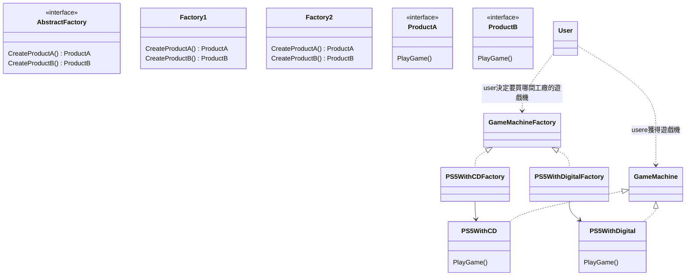
```mermaid
classDiagram
    class AbstractFactory{
        <<interface>>
        CreateProductA() ProductA
		CreateProductB() ProductB
    }
    class Factory1{
        CreateProductA() ProductA
		CreateProductB() ProductB
    }
    class Factory2{
        CreateProductA() ProductA
		CreateProductB() ProductB
    }
    class ProductA{
        <<interface>>
        PlayGame()
    }
	class ProductB{
        <<interface>>
        PlayGame()
    }
    class PS5WithCD{
        PlayGame()
    }
    class PS5WithDigital{
        PlayGame()
    }

    PS5WithCDFactory --> PS5WithCD
    PS5WithDigitalFactory --> PS5WithDigital
    GameMachine <|.. PS5WithCD
    GameMachine <|.. PS5WithDigital
    GameMachineFactory <|.. PS5WithCDFactory
    GameMachineFactory <|.. PS5WithDigitalFactory
    User ..> GameMachineFactory: user決定要買哪間工廠的遊戲機
    User ..> GameMachine: usere獲得遊戲機
```

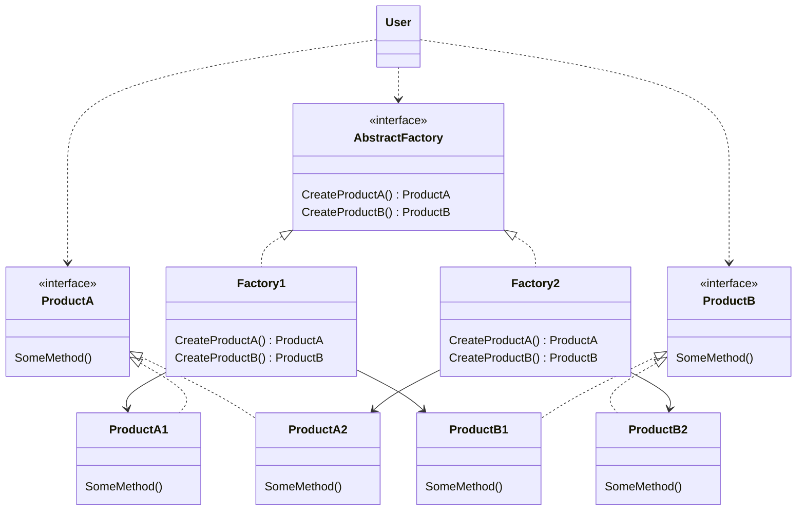
```mermaid
classDiagram
    class AbstractFactory{
        <<interface>>
        CreateProductA() ProductA
		CreateProductB() ProductB
    }
    class Factory1{
        CreateProductA() ProductA
		CreateProductB() ProductB
    }
    class Factory2{
        CreateProductA() ProductA
		CreateProductB() ProductB
    }
    class ProductA{
        <<interface>>
        SomeMethod()
    }
	class ProductB{
        <<interface>>
        SomeMethod()
    }
    class ProductA1{
        SomeMethod()
    }
    class ProductA2{
        SomeMethod()
    }
    class ProductB1{
        SomeMethod()
    }
    class ProductB2{
        SomeMethod()
    }

    User ..> AbstractFactory
    User ..> ProductA
    User ..> ProductB

    AbstractFactory <|.. Factory1
    AbstractFactory <|.. Factory2

    ProductA <|.. ProductA1
    ProductB <|.. ProductB1

    Factory1 --> ProductA1
    Factory1 --> ProductB1

    Factory2 --> ProductA2
    Factory2 --> ProductB2

    ProductA <|.. ProductA2

    ProductB <|.. ProductB2
```

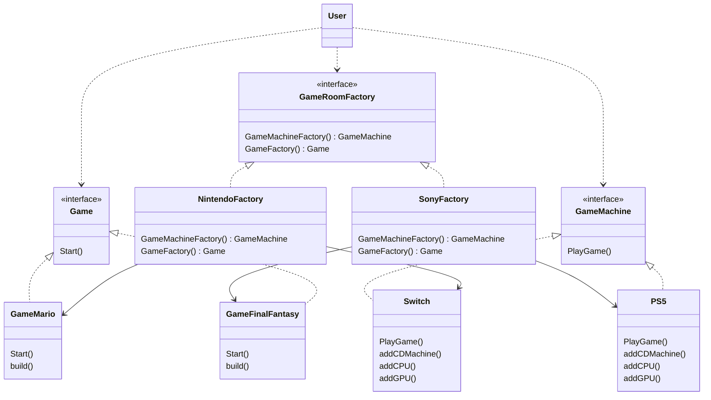
```mermaid
classDiagram
    class GameRoomFactory{
        <<interface>>
        GameMachineFactory() GameMachine
		GameFactory() Game
    }
    class SonyFactory{
        GameMachineFactory() GameMachine
		GameFactory() Game
    }
    class NintendoFactory{
        GameMachineFactory() GameMachine
		GameFactory() Game
    }
    class Game{
        <<interface>>
        Start()
    }
	class GameMachine{
        <<interface>>
        PlayGame()
    }
    class GameMario{
        Start()
        build()
    }
    class GameFinalFantasy{
        Start()
        build()
    }
    class PS5{
        PlayGame()
        addCDMachine()
        addCPU()
        addGPU()
    }
    class Switch{
        PlayGame()
        addCDMachine()
        addCPU()
        addGPU()
    }

    User ..> Game

    User ..> GameMachine
    User ..> GameRoomFactory

    GameRoomFactory <|.. SonyFactory
    GameRoomFactory <|.. NintendoFactory

    Game <|.. GameMario
    GameMachine <|.. Switch

    SonyFactory --> GameFinalFantasy
    SonyFactory --> PS5


    NintendoFactory --> GameMario
    NintendoFactory --> Switch


    Game <|.. GameFinalFantasy

    GameMachine <|.. PS5
```

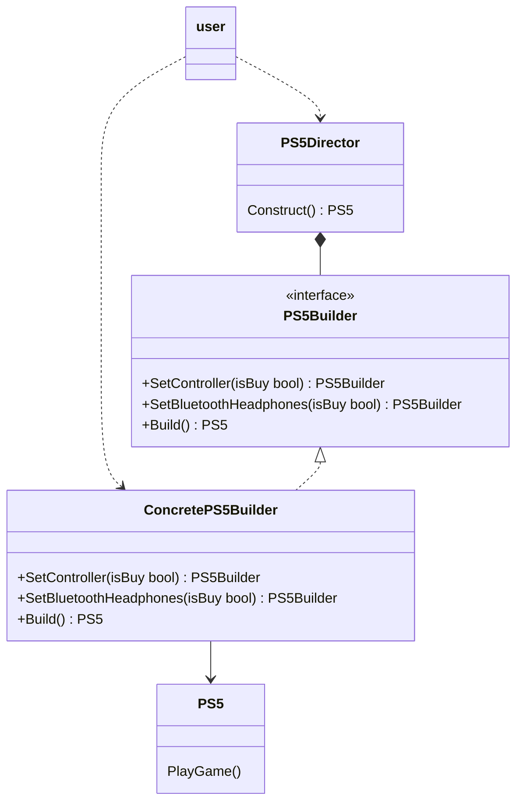
```mermaid
classDiagram
    class PS5Builder{
        <<interface>>
        +SetController(isBuy bool) PS5Builder
        +SetBluetoothHeadphones(isBuy bool) PS5Builder
        +Build() PS5
    }
    class ConcretePS5Builder{
        +SetController(isBuy bool) PS5Builder
        +SetBluetoothHeadphones(isBuy bool) PS5Builder
        +Build() PS5
    }
    class PS5Director{
        Construct() PS5
    }
    class PS5{
        PlayGame()
    }
    user ..> PS5Director
    PS5Director *-- PS5Builder
    user ..> ConcretePS5Builder
    ConcretePS5Builder --> PS5
    PS5Builder <|.. ConcretePS5Builder
```

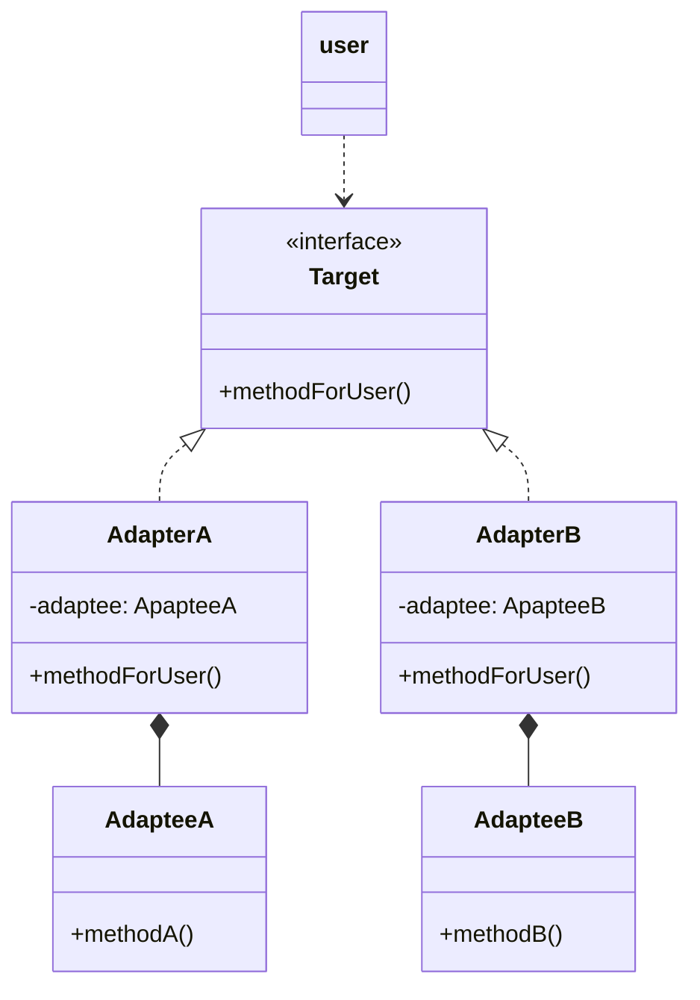
```mermaid
classDiagram
	class AdapterA{
		-adaptee: ApapteeA
		+methodForUser()
	}
	class AdapteeA{
		+methodA()
	}
	class AdapterB{
		-adaptee: ApapteeB
		+methodForUser()
	}
	class AdapteeB{
		+methodB()
	}
	class Target{
		<<interface>>
		+methodForUser()
	}
    user ..> Target
	Target <|.. AdapterA
	AdapterA *-- AdapteeA
	Target <|.. AdapterB
	AdapterB *-- AdapteeB
```

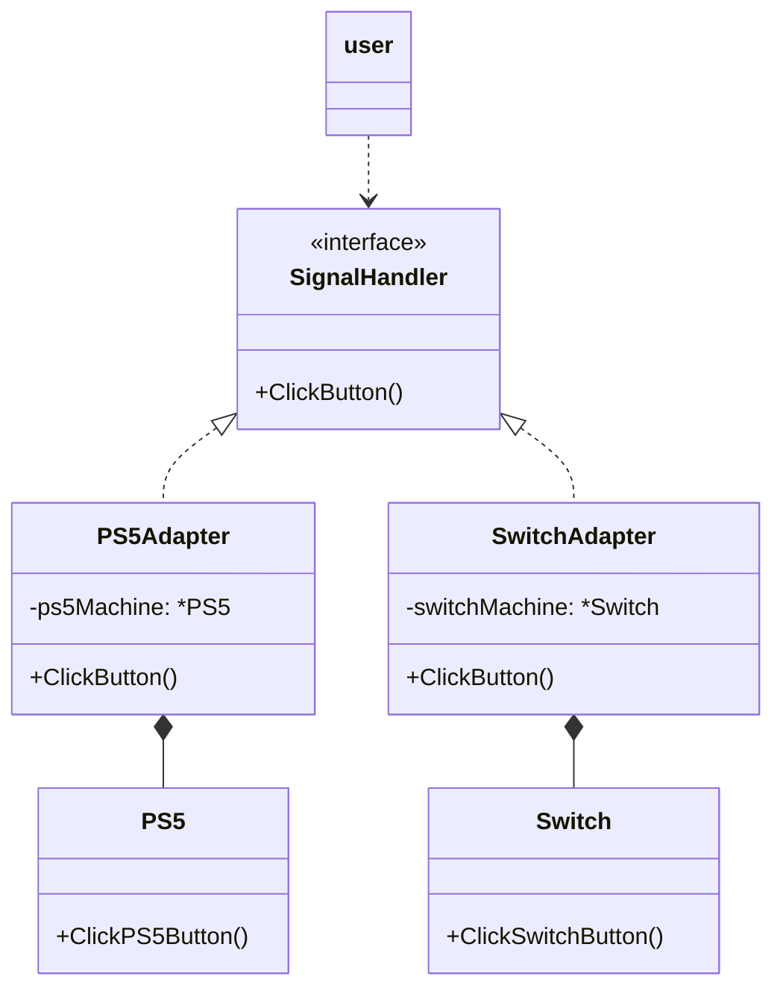
```mermaid
classDiagram
	class PS5Adapter{
		-ps5Machine: *PS5
		+ClickButton()
	}
	class PS5{
		+ClickPS5Button()
	}
	class SwitchAdapter{
		-switchMachine: *Switch
		+ClickButton()
	}
	class Switch{
		+ClickSwitchButton()
	}
	class SignalHandler{
		<<interface>>
		+ClickButton()
	}
    user ..> SignalHandler
	SignalHandler <|.. PS5Adapter
	PS5Adapter *-- PS5
	SignalHandler <|.. SwitchAdapter
	SwitchAdapter *-- Switch
```

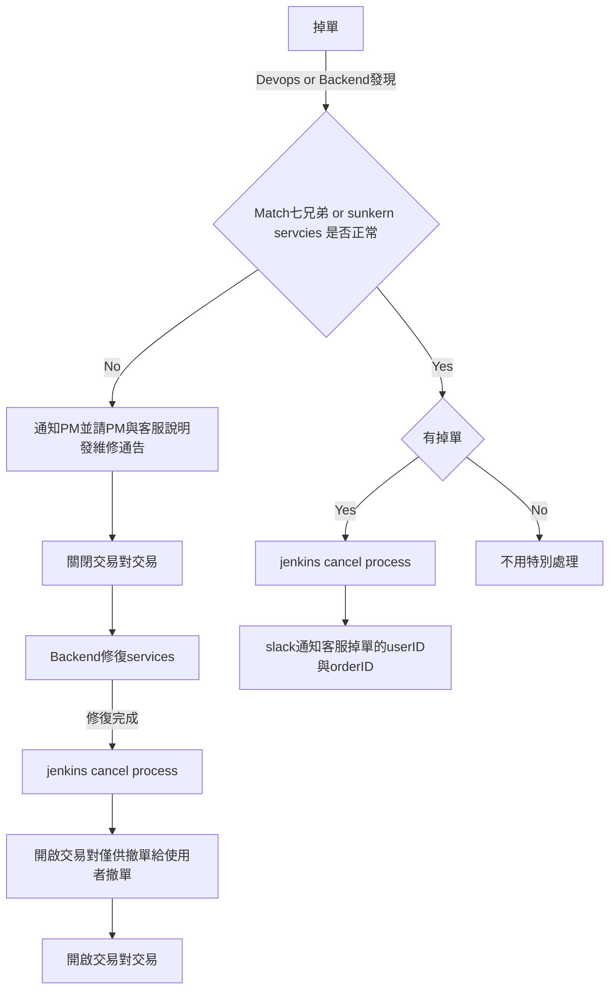
```mermaid
graph TD
    A[掉單] -->|Devops or Backend發現| B{Match七兄弟 or sunkern servcies 是否正常}
    B -->|Yes| C{有掉單}
    B -->|No| F[通知PM並請PM與客服說明發維修通告]
    F -->H[關閉交易對交易]
    H -->I[Backend修復services]
    I -->|修復完成| J[jenkins cancel process]
    J -->K[開啟交易對僅供撤單給使用者撤單]
    K -->L[開啟交易對交易]
    C -->|Yes| D[jenkins cancel process]
    D --> G[slack通知客服掉單的userID與orderID]
    C -->|No| E[不用特別處理]


```

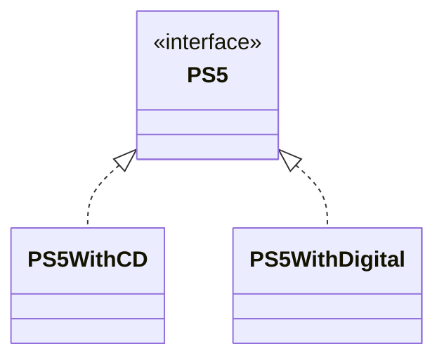
```mermaid
classDiagram
	class PS5{
		<<interface>>
	}
	PS5 <|.. PS5WithCD
	PS5 <|.. PS5WithDigital
```

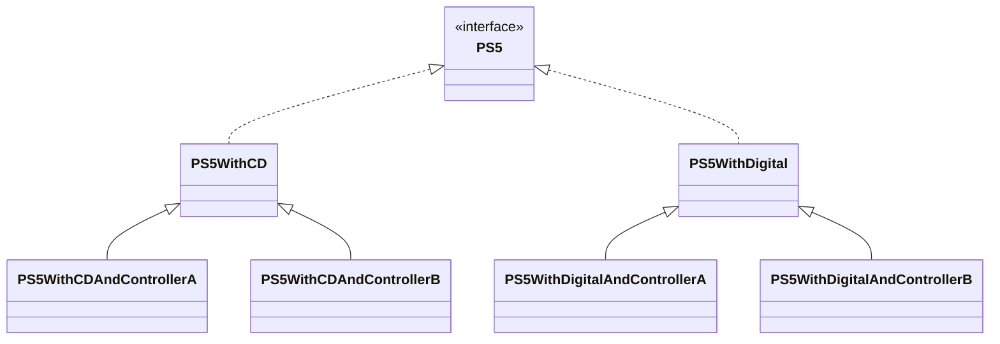
```mermaid
classDiagram
	class PS5{
		<<interface>>
	}
	PS5 <|.. PS5WithCD
	PS5 <|.. PS5WithDigital
	PS5WithCD <|-- PS5WithCDAndControllerA
	PS5WithCD <|-- PS5WithCDAndControllerB
	PS5WithDigital <|-- PS5WithDigitalAndControllerA
	PS5WithDigital <|-- PS5WithDigitalAndControllerB
```

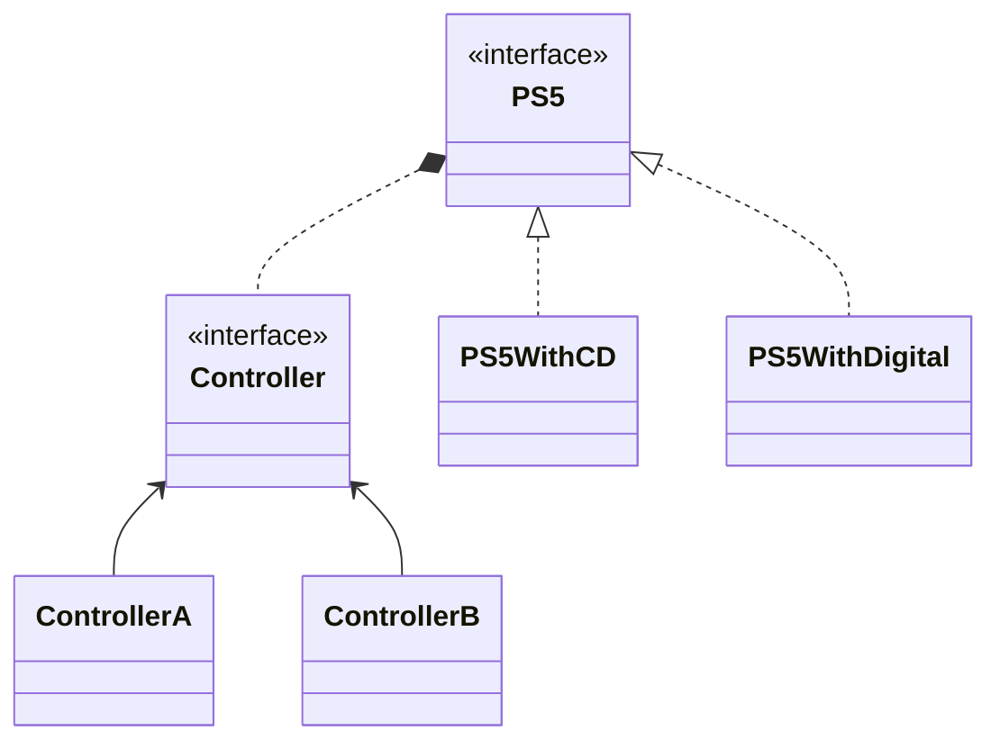
```mermaid
classDiagram
	class PS5{
		<<interface>>
	}
	class Controller{
		<<interface>>
	}
	PS5 <|.. PS5WithCD
	PS5 <|.. PS5WithDigital
	Controller <-- ControllerA
	Controller <-- ControllerB
	PS5 *.. Controller
```

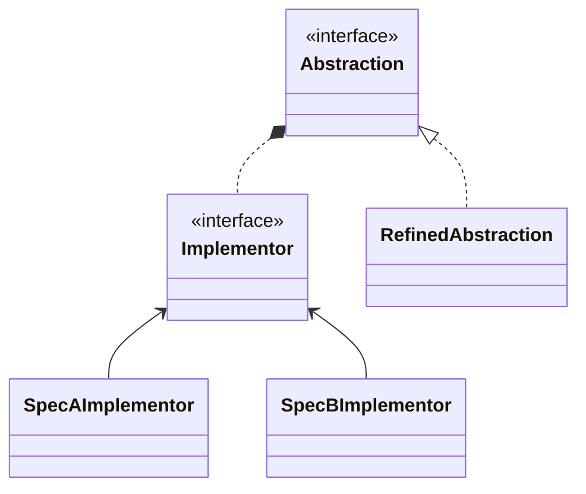
```mermaid
classDiagram
	class Abstraction{
		<<interface>>
	}
	class Implementor{
		<<interface>>
	}
	Abstraction <|.. RefinedAbstraction
	Implementor <-- SpecAImplementor
	Implementor <-- SpecBImplementor
	Abstraction *.. Implementor
```

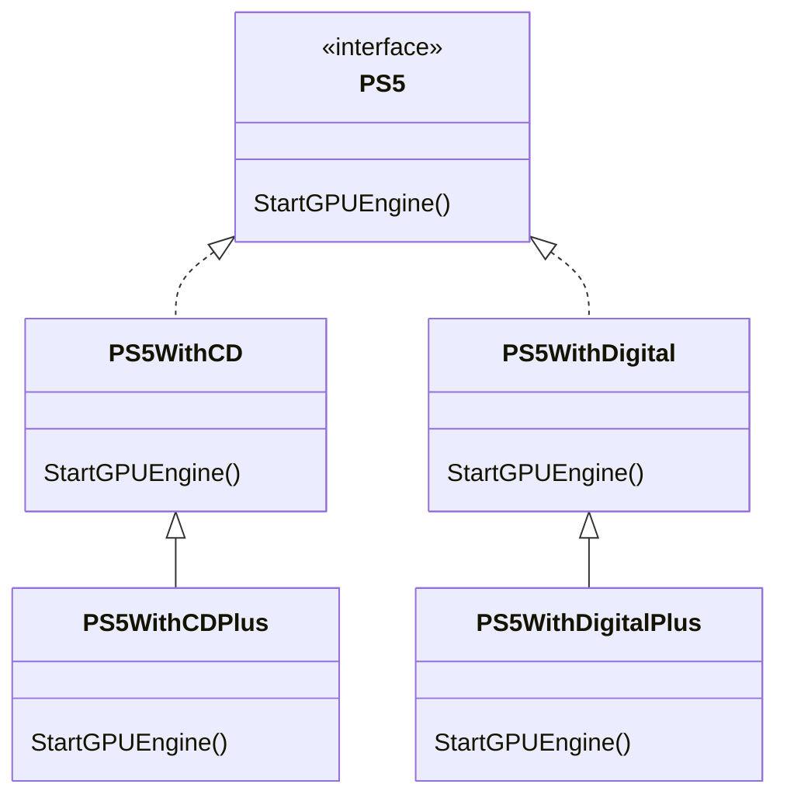
```mermaid
classDiagram
	class PS5{
		<<interface>>
		StartGPUEngine()
	}
	class PS5WithCD{
		StartGPUEngine()
	}
	class PS5WithDigital{
		StartGPUEngine()
	}
	class PS5WithCDPlus{
		StartGPUEngine()
	}
	class PS5WithDigitalPlus{
		StartGPUEngine()
	}
	PS5 <|.. PS5WithCD
	PS5 <|.. PS5WithDigital
	PS5WithCD <|-- PS5WithCDPlus
	PS5WithDigital <|-- PS5WithDigitalPlus
```

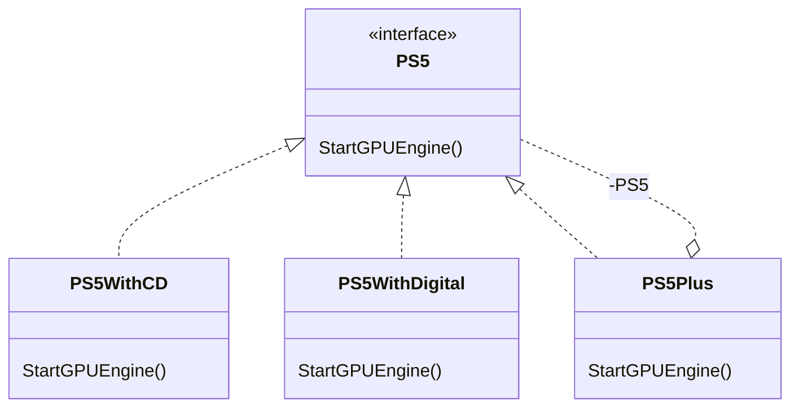
```mermaid
classDiagram
	class PS5{
		<<interface>>
		StartGPUEngine()
	}
	class PS5WithCD{
		StartGPUEngine()
	}
	class PS5WithDigital{
		StartGPUEngine()
	}
	class PS5Plus{
		StartGPUEngine()
	}
	PS5 <|.. PS5WithCD
	PS5 <|.. PS5WithDigital
	PS5 <|.. PS5Plus
	PS5 ..o PS5Plus: -PS5
```

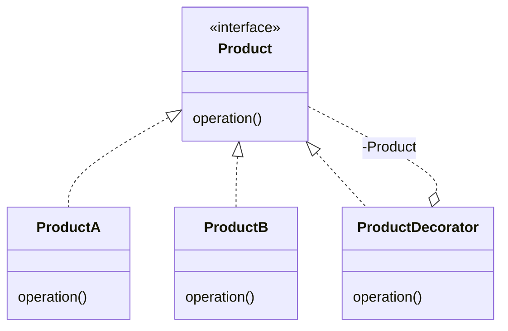
```mermaid
classDiagram
	class Product{
		<<interface>>
		operation()
	}
	class ProductA{
		operation()
	}
	class ProductB{
		operation()
	}
	class ProductDecorator{
		operation()
	}
	Product <|.. ProductA
	Product <|.. ProductB
	Product <|.. ProductDecorator
	Product ..o ProductDecorator: -Product
```

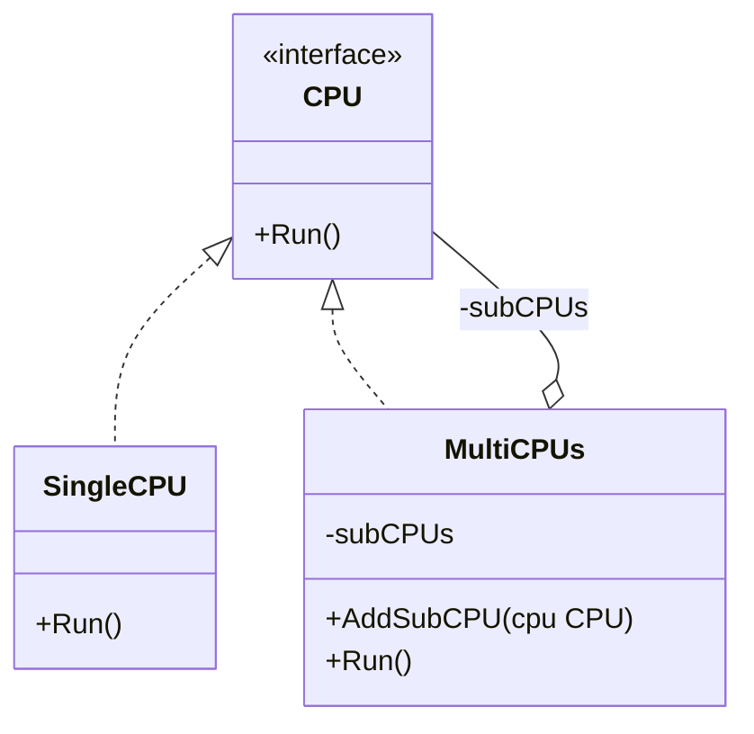
```mermaid
classDiagram
	class CPU{
		<<interface>>
		+Run()
	}
	class SingleCPU{
		+Run()
	}
	class MultiCPUs{
		-subCPUs
		+AddSubCPU(cpu CPU)
		+Run()
	}
	CPU <|.. SingleCPU
	CPU <|.. MultiCPUs
	CPU --o MultiCPUs : -subCPUs
```

```mermaid
classDiagram
	class Component{
		<<interface>>
		+Operation()
	}
	class Part{
		+Operation()
	}
	class Composite{
		-componets
		+AddComponet(component Component)
		+Operation()
	}
	Component <|.. Part
	Component <|.. Composite
	Component --o Composite : -componets
```

```mermaid
classDiagram
	class PS5{
		<<interface>>
		PlayGame()
	}
	class PS5Machine{
		PlayGame()
	}
	class PS5MachineProxy{
		PlayGame()
	}
	PS5 <|.. PS5Machine
	PS5 <|.. PS5MachineProxy
	PS5 ..o PS5MachineProxy: -PS5
```

```mermaid
classDiagram
	class Product{
		<<interface>>
		operation()
	}
	class ProductImplement{
		operation()
	}
	class ProductProxy{
		operation()
	}
	Product <|.. ProductImplement
	Product <|.. ProductProxy
	Product ..o ProductProxy: -Product
```

```mermaid
classDiagram
	user --> Handler
	Handler --> Handler: next
	Handler <|.. ConcreteHandler1
	Handler <|.. ConcreteHandler2
```

```mermaid
classDiagram
	class strategy{
		<<interface>>
		+doSomething()
	}
	class concreteStrategy1{
		+doSomething()
	}
	class concreteStrategy2{
		+doSomething()
	}
	class concreteStrategy3{
		+doSomething()
	}
	user o.. strategy: -strategy
	strategy <|.. concreteStrategy1
	strategy <|.. concreteStrategy2
	strategy <|.. concreteStrategy3
```

```mermaid
classDiagram
	class GPU{
		<<interface>>
		+Draw()
	}
	class AGPU{
		+Draw()
	}
	class BGPU{
		+Draw()
	}
	class CGPU{
		+Draw()
	}
	PS5 o.. GPU: -GPU
	GPU <|.. AGPU
	GPU <|.. BGPU
	GPU <|.. CGPU
```
